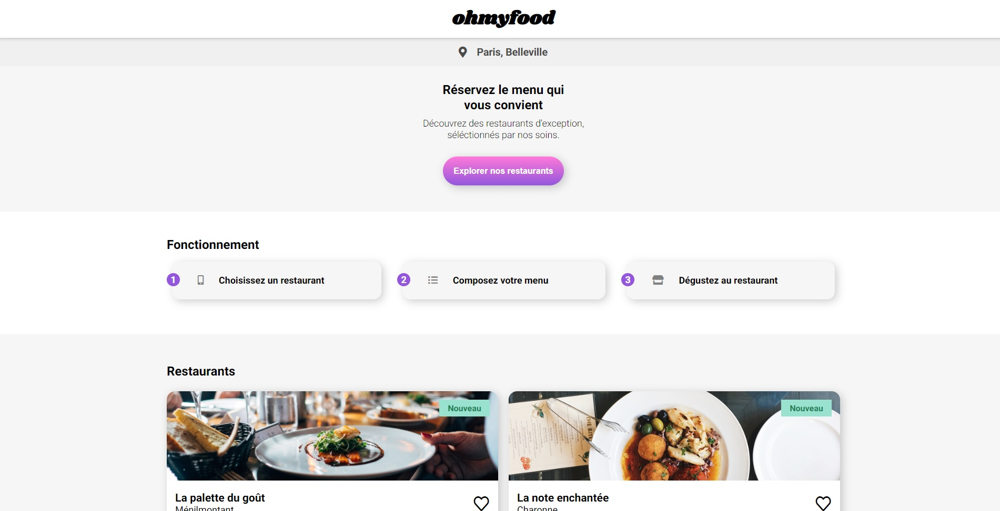

# ohmyfood

## A restaurant web page where you can chose your can customize your menu



**Technology used :**

-   HTML
-   CSS
-   SCSS

## How to run this page

you can access directly to the page of this project : https://julien7442.github.io/ohmyfood/index.html

otherwise you can :

clone the project

```terminal
https://github.com/Julien7442/ohmyfood.git
```

If you plan to modify anything just install sass

```terminal
npm install sass
```

Once sass is installed use this command to execute sass post processor

```terminal
npm run sass
```

Any changes in the _.scss_ files will be directly added to _style.css_

## Notes

**Polices :**

-   Logo & title : Shrikhand
-   Texte : Roboto

**Colors :**

-   Primary: #9356DC
-   Secondary: #FF79DA
-   Tertiary: #99E2D0
